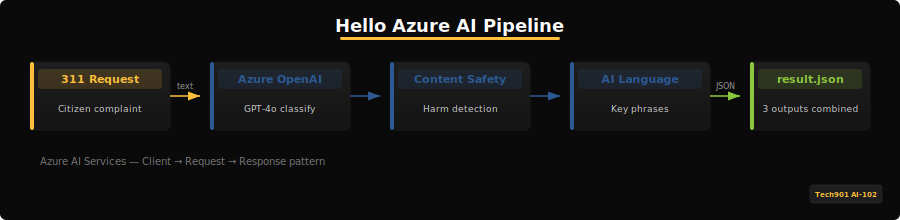
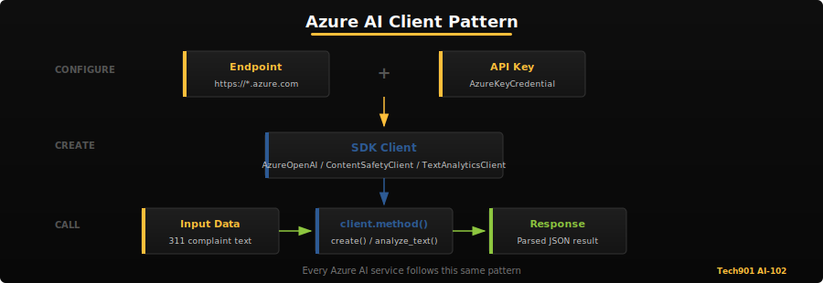
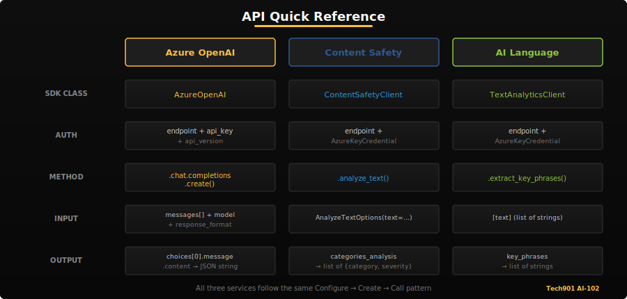

# Activity 1 -- Hello, Azure AI

## Welcome

In this activity you will make your first API calls to three Azure AI services. By the end you will have a working Python script that:

- **Classifies** a Memphis 311 service request using Azure OpenAI (GPT-4o)
- **Checks** text for harmful content using Azure Content Safety
- **Extracts** key phrases from a citizen complaint using Azure AI Language

All three responses are collected into a single `result.json` file that the autograder validates.



> [!IMPORTANT]
> **Learning Objective** -- Understand how Azure AI services accept requests and return structured responses. Every service follows the same pattern: create a client, send a request, read the response.

## Before You Start -- Think Like an Architect

Before touching any code, imagine you work at the Memphis 311 call center. A complaint arrives:

> *"Somebody dumped a whole living room set in the vacant lot on Chelsea. Now the rats are moving in."*

**What steps would a human clerk take before dispatching a crew?** Grab a piece of paper (or open a scratch file) and jot down 2-3 steps. Think about what the clerk needs to figure out, check, and summarize before handing the complaint off.

Hold on to your list -- you will revisit it after Step 3.

> [!NOTE]
> **What You Will Learn**
> - The **client-request-response** pattern that every Azure AI SDK follows
> - The difference between **single-service keys** (one key per service) and **multi-service keys** (one key for many services under an Azure AI Services resource)
> - Why **lazy initialization** matters -- you will notice that `main.py` does not create any Azure clients at the top of the file. Instead, each client is created inside a helper function the first time it is called. This avoids crashes when Python imports the file but credentials are not set yet (for example, during test collection or linting)



> [!TIP]
> **Why SDKs?** Wondering why we use `AzureOpenAI(...)` instead of raw HTTP calls?
> See the [SDK vs REST API Reference](reference/sdk-vs-api.md) for a side-by-side comparison.

---

## Setup

> [!NOTE]
> The AI-102 exam now uses "Microsoft Foundry" branding for Azure AI services. The SDK names and service endpoints remain the same.

### 1. Open in Codespaces

Click the green **Code** button on your GitHub repository page and select **Open with Codespaces**. The dev container will install Python 3.11 and all dependencies automatically.

If you prefer to work locally, clone the repo and run:

```bash
python -m venv .venv
source .venv/bin/activate   # Windows: .venv\Scripts\activate
pip install -r requirements.txt
```

### 2. Configure Environment Variables

**If you are using Codespaces** (recommended), your credentials are already configured. Verify by running:

```bash
printenv | grep AZURE
```

You should see seven variables (three endpoint/key pairs plus `AZURE_OPENAI_DEPLOYMENT`, which defaults to `gpt-4o` if not set). If they appear, skip to Step 3.

**If you are working locally**, copy the example file and fill in your credentials:

```bash
cp .env.example .env
```

Open `.env` and replace the placeholder values with the endpoints and keys provided by your instructor.

> [!WARNING]
> Never commit your `.env` file. It is listed in `.gitignore` for a reason. If you accidentally push credentials, notify your instructor immediately.

### 3. Verify Your Setup

Run the visible tests to confirm the environment is ready:

```bash
pytest tests/test_basic.py -v
```

You should see `test_result_exists` **FAIL** (because you have not run the script yet) and `test_no_hardcoded_keys` **PASS**. The remaining tests will be skipped until `result.json` exists.

---

## Step 1 -- Classify a 311 Request with Azure OpenAI

Open `app/main.py` and find the `classify_311_request` function. Your goal is to send the complaint text to GPT-4o and get back a JSON object with three fields: `category`, `confidence`, and `reasoning` (where `confidence` is a number between 0 and 1).

### 1.1 Initialize the Client

Uncomment the code inside `_get_openai_client()`. The `AzureOpenAI` class needs three parameters: `azure_endpoint`, `api_key`, and `api_version`.

### 1.2 Build the Chat Request

Use `client.chat.completions.create()` with:

- A **system message** that instructs the model to classify into one of these categories: `Pothole`, `Noise Complaint`, `Trash/Litter`, `Street Light`, `Water/Sewer`, `Other`
- A **user message** containing the complaint text
- Clear JSON requirements:
  - `category`: one of the six categories listed above
  - `confidence`: a number in the range 0.0 to 1.0 (not a percentage)
  - `reasoning`: a short explanation (string)
- `response_format={"type": "json_object"}` so the model returns valid JSON
- `temperature=0` for deterministic output

### 1.3 Parse the Response

The model's reply is in `response.choices[0].message.content`. Parse it with `json.loads()` and return a dict with keys `category`, `confidence`, and `reasoning`.

> [!TIP]
> **Prompt Design** -- Include the exact category names in your system message and ask the model to return JSON with the three required keys. A well-structured prompt makes parsing easier.

> [!NOTE]
> **Self-Check** (10 points)
> ```bash
> pytest tests/test_basic.py::test_outputs_has_classification -v
> ```

> [!TIP]
> **Try This (~10 min)** -- Now that classification works, experiment with your prompt:
> - Remove the category list from your system message. Does the model invent its own categories?
> - Change `temperature` from `0` to `1.0` and run the same complaint three times. Do you get different results?
> - Try a complaint of your own -- something not in the sample data. How does the model handle it?
>
> Noticing how prompts affect output is a key AI-102 skill. You will formalize this in Activity 3.

> [!IMPORTANT]
> **Reflection Seed** -- What surprised you about how easy (or hard) it was to get accurate classifications? Hold that thought for REFLECTION.md.

---

## Step 2 -- Check Content Safety

Find the `check_content_safety` function. Azure Content Safety analyzes text across four harm categories: Hate, SelfHarm, Sexual, and Violence. Each category returns a severity score from 0 (safe) to 6 (severe).

### 2.1 Initialize the Client

Uncomment the code inside `_get_content_safety_client()`. The `ContentSafetyClient` takes an `endpoint` and `AzureKeyCredential`.

### 2.2 Analyze the Text

Import `AnalyzeTextOptions` from `azure.ai.contentsafety.models` and call:

```python
result = client.analyze_text(AnalyzeTextOptions(text=text))
```

### 2.3 Build the Response

Iterate over `result.categories_analysis` to build a dict of category names to severity scores. Set `safe` to `True` if all severities are 0.

Return:

```python
{"safe": True, "categories": {"Hate": 0, "SelfHarm": 0, ...}}
```

> [!IMPORTANT]
> **Exam Connection (D1.4)**: The AI-102 exam asks when to use the Content Safety API vs built-in OpenAI content filters vs custom blocklists. The API gives you fine-grained severity scores per category; built-in filters are automatic but less configurable; blocklists let you block specific terms. Know which approach fits which scenario.

> [!NOTE]
> **Self-Check** (10 points)
> ```bash
> pytest tests/test_basic.py::test_outputs_has_content_safety -v
> ```

> [!TIP]
> **Try This (~10 min)** -- Test the boundaries of Content Safety:
> - Send a complaint that describes factual violence: *"A man was hit by a car at this intersection."* What severity scores come back?
> - Try strong language: *"I'm sick and tired of this garbage. Fix it!"* Does frustration register as harmful content?
> - Compare severity scores across two or three different complaints from `data/sample_requests.json`.
>
> The AI-102 exam tests your ability to interpret severity levels and decide what action to take at each threshold.

> [!IMPORTANT]
> **Reflection Seed** -- If Content Safety flags a legitimate complaint describing an assault or dangerous conditions, what should the system do? Block it? Flag it? Pass it through? There's no single right answer -- but you need one for REFLECTION.md.

---

## Step 3 -- Extract Key Phrases

Find the `extract_key_phrases` function. Azure AI Language identifies the main talking points in a block of text.

### 3.1 Initialize the Client

Uncomment the code inside `_get_language_client()`. The `TextAnalyticsClient` takes an `endpoint` and `AzureKeyCredential`.

### 3.2 Call the API

Pass the text as a single-element list:

```python
response = client.extract_key_phrases([text])
```

### 3.3 Return Key Phrases

Check that `response[0].is_error` is `False`, then return `response[0].key_phrases` (a list of strings).

> [!NOTE]
> **Self-Check** (10 points)
> ```bash
> pytest tests/test_basic.py::test_outputs_has_key_phrases -v
> ```

> [!TIP]
> **Try This (~10 min)** -- Explore how the Language service handles different inputs:
> - Run several complaints from `data/sample_requests.json` and compare the key phrases. Which complaint produces the most useful summary?
> - Try the ambiguous complaint SR-008 (index 7): `python app/main.py 7`. It mentions both road damage and noise. Do the key phrases capture both issues?
> - Try passing multiple texts at once as a batch. How does the response structure change?
>
> Batch processing becomes important in Activity 5 when you analyze many complaints at scale.

---

## Connecting the Dots

Pull out the list you wrote in "Think Like an Architect." A human clerk would probably:

1. **Figure out what kind of problem it is** so they route it to the right department
2. **Check whether the language is appropriate** before passing it to a dispatcher
3. **Summarize the key facts** so the crew knows what to expect

Now look at the three services you just called:

| Clerk's step | Azure AI service | Your function |
|---|---|---|
| Route to department | Azure OpenAI (GPT-4o) | `classify_311_request()` |
| Screen for harmful content | Azure Content Safety | `check_content_safety()` |
| Summarize key facts | Azure AI Language | `extract_key_phrases()` |

These three services are not random picks -- they map directly to what a human would do. Together, they form the first building block of the Memphis 311 AI Platform you will assemble piece by piece through Activities 2-7, then wire together in Activity 8 (Capstone).



> [!TIP]
> **Pipeline Ordering** -- In production, you would run Content Safety *first* before spending compute on classification and key phrases. Why send a request through GPT-4o if it contains harmful content that will be rejected anyway? You will formalize this ordering in Activity 2 when you architect the full platform.

> [!IMPORTANT]
> **Reflection Seed** -- Which of the three services could you remove and still have a functional system? Which one is the hardest to replace? Think about this before answering your REFLECTION.md questions.

> [!NOTE]
> **Where These Services Return**: The Azure OpenAI client you built here reappears in A3 (triage engine), A4 (multimodal classification), A7 (RAG answers), and A8 (capstone). Content Safety returns in A8 to screen the full pipeline. The Language service comes back in A5 (constituent hub) with sentiment, PII, and translation.

---

## Optional: Document an Experiment

Pick one experiment you tried (or try a new one now) and document it in your `REFLECTION.md` file. Write 2-3 sentences covering:

- **What you changed** (prompt wording, temperature, input text, etc.)
- **What happened** (different category, unexpected severity score, missing key phrases, etc.)
- **What you learned** (about the service, about prompt design, about AI behavior)

This is not graded -- it is practice. In Activity 3, you will run a formal parameter sweep across prompt templates and temperature settings. This informal experimentation builds the instinct for what to vary and what to measure.

---

## Troubleshooting

| Error | Cause | Fix |
|-------|-------|-----|
| `AuthenticationError` / `401` | Endpoint URL and API key do not match, or the key is invalid. | Double-check that your endpoint URL and key pair correspond to the same Azure resource. |
| `ResourceNotFoundError` / `404` | The model deployment name is wrong or the resource does not exist. | Verify `AZURE_OPENAI_DEPLOYMENT` (default: `gpt-4o`) matches the actual deployment in your Azure portal. |
| `InvalidRequestError` | The request body is malformed or the text is empty. | Ensure your request text is not an empty string before calling the API. |
| `429 Too Many Requests` | You have exceeded the rate limit for the service. | Wait 30 seconds and retry. If it persists, ask your instructor about quota limits. |

---

## Reflection

You have been thinking about these questions as you worked -- now formalize your answers. Open `REFLECTION.md` and write 2-3 sentences for each question. Connect your responses to specific things you observed during the activity.

---

## Running and Submitting

### Run Your Script

From the folder that contains `app/` and `tests/`, run:

```bash
python app/main.py
```

> [!TIP]
> If you see an error like `python: can't open file 'app/main.py'`, you are in the wrong directory. `cd` into the folder that contains `app/` and `tests/`, then try again.

This calls all three services and writes `result.json`. You will also see a dispatch ticket summary printed to the console. Check the raw output:

```bash
python -m json.tool result.json
```

You should see `"status": "success"` with populated `classification`, `content_safety`, and `key_phrases` fields.

### Run All Tests

```bash
pytest tests/ -v
```

All visible tests should pass. The hidden autograder tests run automatically when you push.

### Submit

Commit and push your changes:

```bash
git add app/main.py REFLECTION.md
git commit -m "Complete Activity 1"
git push
```

The GitHub Actions autograder will run both visible and hidden tests. Check the **Actions** tab for your score.

> [!NOTE]
> **Final Check** (10 points)
> ```bash
> pytest tests/test_basic.py -v
> ```

> [!IMPORTANT]
> **What You Learned** -- You connected to three different Azure AI services (OpenAI, Content Safety, Language) using the same pattern: create a client with endpoint + key, send a request, parse the response. This client-request-response pattern is the foundation for every Azure AI integration you will build in this course.
